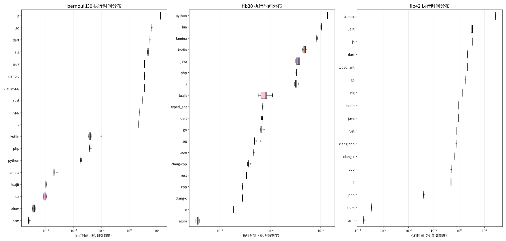

# LangBench 测试报告

## 性能图表

### 执行时间箱线图

## bernoulli30

| 语言 | 平均时间(μs) | 中位数(μs) | 最小时间(μs) | 最大时间(μs) | 标准差(μs) | 成功率 |
|------|------------------|-----------------|------------------|------------------|-----------------|--------|
| asm | 243.1 | 240.2 | 231.3 | 267.7 | 10.3 | 100.0% |
| alum | 369.0 | 381.5 | 328.8 | 412.5 | 30.1 | 100.0% |
| lua | 931.4 | 935.9 | 831.1 | 1052.4 | 90.7 | 100.0% |
| luajit | 1009.6 | 1006.1 | 991.8 | 1044.3 | 15.9 | 100.0% |
| lamina | 2007.6 | 1961.7 | 1871.8 | 2505.3 | 178.5 | 100.0% |
| python | 18422.8 | 18456.6 | 17749.5 | 19380.1 | 478.5 | 100.0% |
| php | 38654.2 | 38512.1 | 37187.8 | 42097.3 | 1401.0 | 100.0% |
| kotlin | 44008.6 | 39123.2 | 33770.8 | 98518.8 | 19407.7 | 100.0% |
| c | 2113239.5 | 2113645.4 | 2101866.7 | 2122370.7 | 6794.6 | 100.0% |
| cpp | 2293587.6 | 2287907.6 | 2277027.8 | 2354425.2 | 22280.7 | 100.0% |
| rust | 2942700.8 | 2943519.4 | 2931787.7 | 2961570.0 | 9195.6 | 100.0% |
| clang-cpp | 3552658.4 | 3551338.2 | 3548413.0 | 3559059.1 | 3554.0 | 100.0% |
| clang-c | 3569496.2 | 3553064.8 | 3549985.4 | 3679911.6 | 40187.4 | 100.0% |
| java | 3615050.6 | 3592799.2 | 3557933.3 | 3698190.7 | 53458.3 | 100.0% |
| zig | 4802977.7 | 4808565.0 | 4604154.3 | 5105849.5 | 164572.6 | 100.0% |
| dart | 5649454.0 | 5647095.7 | 5644766.1 | 5662752.2 | 5323.8 | 100.0% |
| go | 6566050.1 | 6567262.3 | 6556930.3 | 6576310.4 | 5279.0 | 100.0% |
| js | 13404238.0 | 13385443.9 | 13363584.8 | 13528009.2 | 52249.5 | 100.0% |

## fib42

| 语言 | 平均时间(μs) | 中位数(μs) | 最小时间(μs) | 最大时间(μs) | 标准差(μs) | 成功率 |
|------|------------------|-----------------|------------------|------------------|-----------------|--------|
| asm | 173.9 | 172.9 | 166.7 | 187.2 | 8.0 | 100.0% |
| alum | 356.4 | 359.1 | 337.1 | 376.9 | 14.8 | 100.0% |
| php | 40366.9 | 40257.0 | 39656.2 | 41474.8 | 693.3 | 100.0% |
| c | 477687.8 | 476924.9 | 476072.3 | 479615.7 | 1514.2 | 100.0% |
| cpp | 485097.5 | 485180.4 | 484240.8 | 485693.2 | 529.1 | 100.0% |
| clang-c | 681969.9 | 681594.8 | 681187.4 | 683429.5 | 929.0 | 100.0% |
| clang-cpp | 760650.4 | 758197.8 | 758017.3 | 770079.1 | 5280.5 | 100.0% |
| rust | 764641.2 | 764238.1 | 764038.6 | 765931.1 | 790.3 | 100.0% |
| java | 970546.6 | 959961.2 | 959349.4 | 993377.2 | 15686.6 | 100.0% |
| kotlin | 971852.6 | 973501.9 | 959899.2 | 986234.2 | 10936.6 | 100.0% |
| zig | 1400592.9 | 1400701.8 | 1399532.8 | 1401810.6 | 850.0 | 100.0% |
| go | 1736458.4 | 1735044.7 | 1734813.5 | 1740856.2 | 2553.1 | 100.0% |
| typed_ant | 2118036.1 | 2117835.3 | 2115968.2 | 2119537.8 | 1383.7 | 100.0% |
| dart | 2125565.5 | 2123009.2 | 2122259.1 | 2136438.6 | 6101.8 | 100.0% |
| luajit | 3247390.2 | 3344469.8 | 2981622.0 | 3465031.4 | 244853.4 | 100.0% |
| js | 3310743.3 | 3305532.5 | 3296084.2 | 3330785.5 | 15457.9 | 100.0% |
| lamina | 27925068.9 | 27890586.9 | 27787822.7 | 28128937.7 | 144985.6 | 100.0% |

## fib30

| 语言 | 平均时间(μs) | 中位数(μs) | 最小时间(μs) | 最大时间(μs) | 标准差(μs) | 成功率 |
|------|------------------|-----------------|------------------|------------------|-----------------|--------|
| alum | 360.8 | 355.1 | 333.5 | 398.9 | 19.5 | 100.0% |
| c | 1879.9 | 1891.3 | 1837.5 | 1913.8 | 27.1 | 100.0% |
| clang-c | 2806.5 | 2800.6 | 2784.3 | 2846.2 | 20.9 | 100.0% |
| cpp | 2847.2 | 2845.4 | 2815.5 | 2875.3 | 20.8 | 100.0% |
| rust | 3381.6 | 3390.4 | 3301.6 | 3442.0 | 44.3 | 100.0% |
| clang-cpp | 3707.6 | 3640.5 | 3521.9 | 4106.0 | 200.5 | 100.0% |
| asm | 4716.1 | 4710.3 | 4702.6 | 4739.5 | 12.7 | 100.0% |
| zig | 5032.2 | 4852.9 | 4802.5 | 6372.9 | 488.1 | 100.0% |
| go | 6706.6 | 6589.3 | 6465.2 | 7556.2 | 334.1 | 100.0% |
| dart | 6863.8 | 6859.5 | 6719.6 | 7024.3 | 82.7 | 100.0% |
| typed_ant | 7122.8 | 7131.6 | 7055.0 | 7166.6 | 37.8 | 100.0% |
| luajit | 8041.5 | 8170.7 | 5779.3 | 11120.1 | 1851.8 | 100.0% |
| js | 32415.2 | 31589.6 | 30417.2 | 36284.0 | 2067.3 | 100.0% |
| php | 33423.0 | 32810.8 | 32367.7 | 37991.5 | 1685.4 | 100.0% |
| java | 36669.4 | 35752.3 | 31314.1 | 44739.0 | 4346.9 | 100.0% |
| kotlin | 48765.6 | 49398.2 | 43191.4 | 53701.4 | 3392.6 | 100.0% |
| lamina | 84376.9 | 83946.8 | 83229.8 | 86651.1 | 1120.5 | 100.0% |
| lua | 103009.8 | 102877.3 | 100664.6 | 105245.8 | 1504.8 | 100.0% |
| python | 137862.6 | 137276.1 | 136551.9 | 141103.7 | 1451.9 | 100.0% |

## 总结

- **bernoulli30**: 最快语言是 asm (平均 243.0916μs)
- **fib42**: 最快语言是 asm (平均 173.9025μs)
- **fib30**: 最快语言是 alum (平均 360.7988μs)

## 失败测试详情

### fib42 - 失败

#### csharp
**错误信息**: `Compilation failed: `

#### vb
**错误信息**: `Compilation failed: `

#### objc
**错误信息**: `Compilation failed: In file included from benchmarks/fib42/fib42.m:1:
/usr/include/GNUstep/Foundation/Foundation.h:31:9: fatal error: 'objc/objc.h' file not found
   31 | #import <objc/objc.h>
      |         ^~~~~~~~~~~~~
1 error generated.
`

---

### bernoulli30 - 失败

#### vb
**错误信息**: `Compilation failed: `

#### csharp
**错误信息**: `Compilation failed: `

---

### fib30 - 失败

#### vb
**错误信息**: `Compilation failed: `

#### csharp
**错误信息**: `Compilation failed: `

#### objc
**错误信息**: `Compilation failed: In file included from benchmarks/fib30/fib30.m:1:
/usr/include/GNUstep/Foundation/Foundation.h:31:9: fatal error: 'objc/objc.h' file not found
   31 | #import <objc/objc.h>
      |         ^~~~~~~~~~~~~
1 error generated.
`

---

